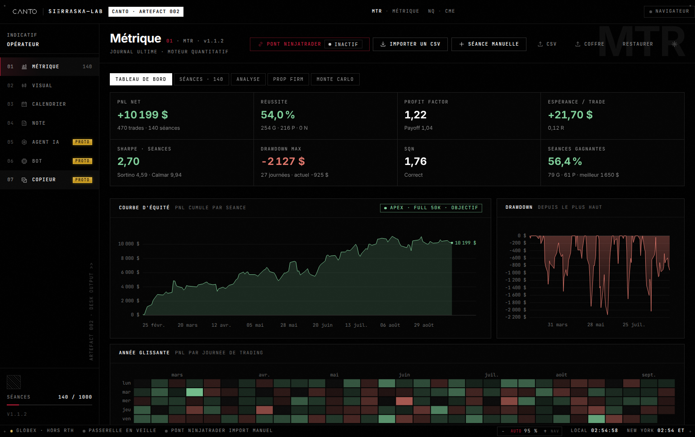
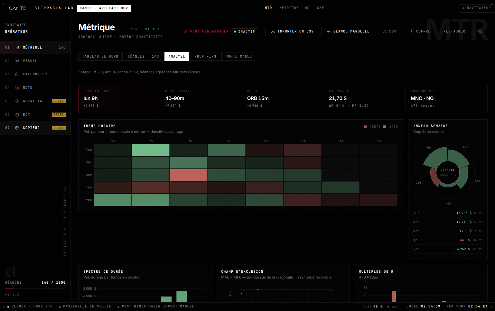
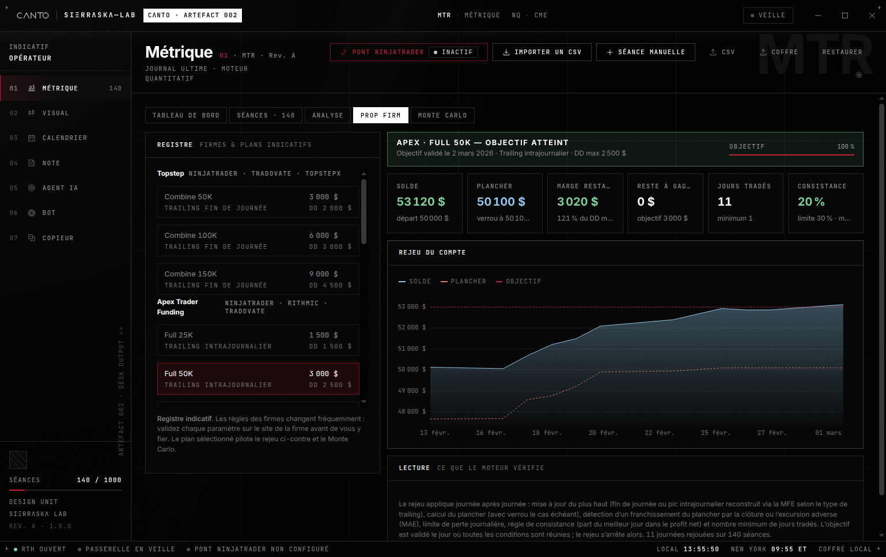
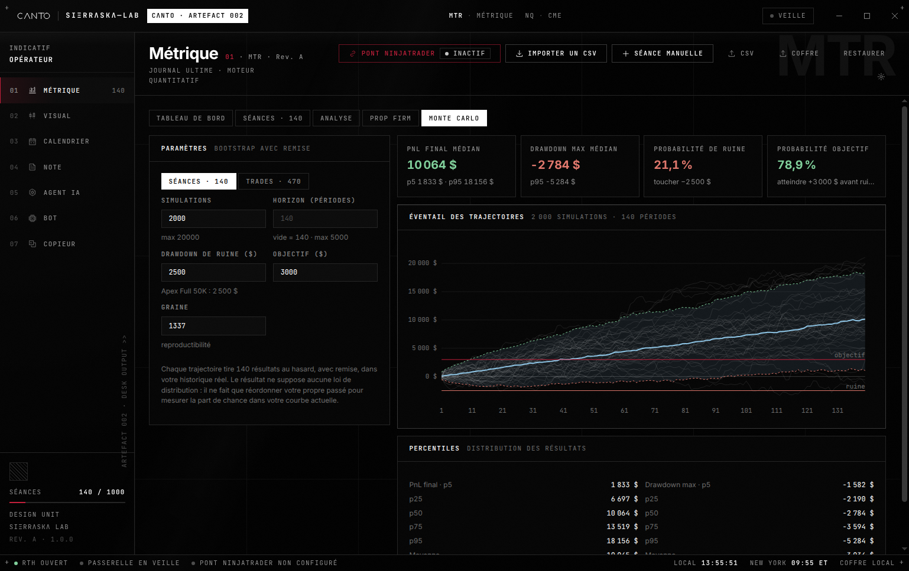
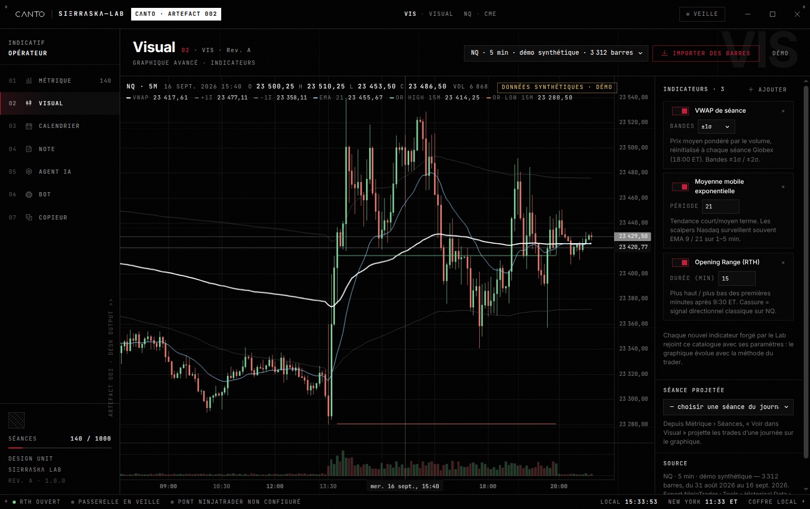
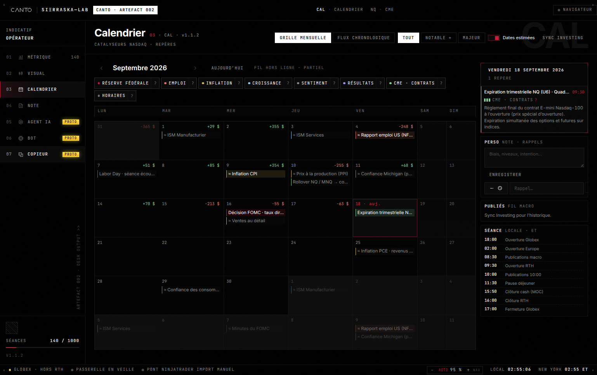
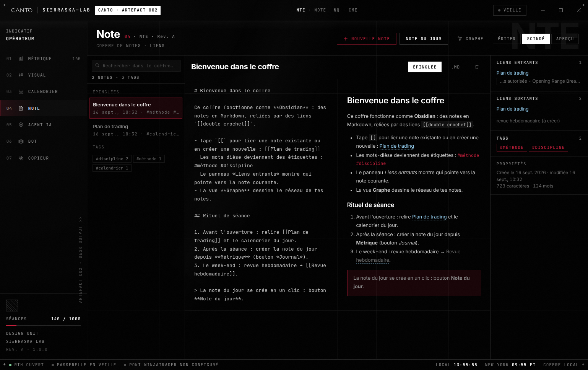
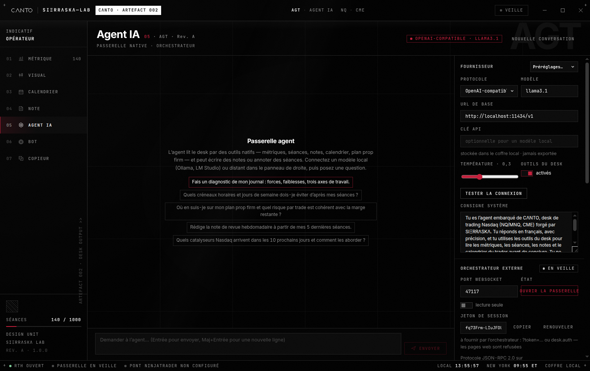
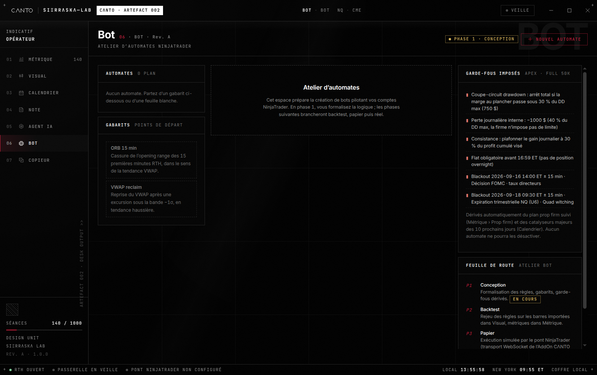
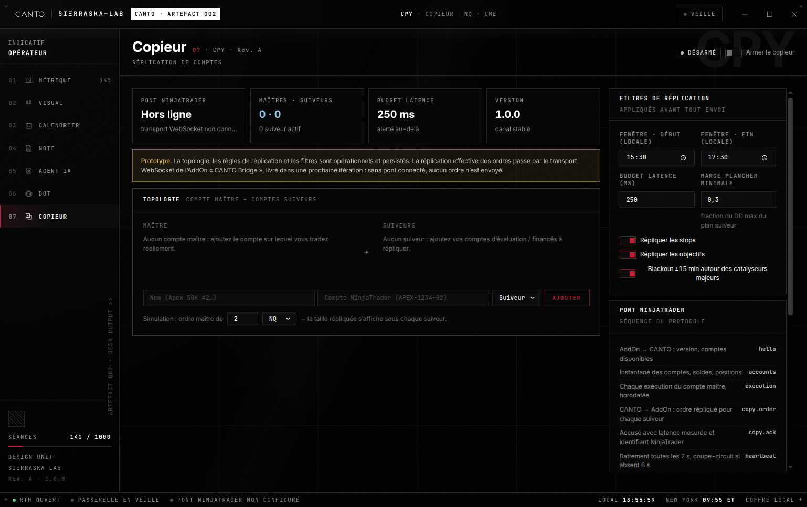

<div align="center">

<br/>

**`SIΞRRΛSKΛ—LAB · CΛNTO · ARTEFACT 002 · REV. V2.0.2 · DESK OUTPUT`**

# CΛNTO

### A local trading desk for Nasdaq-100 futures (NQ / MNQ, CME Globex)

An artefact from **SIΞRRΛSKΛ Lab** — quantitative journal, NinjaTrader 8 bridge, catalyst calendar, notes, AI agent, automations, and copier, in one local application. **v2.0.2** installs natively on **macOS, Windows, and Linux**: the whole desk, including the NT8 bridge, runs on each OS. Data stays 100% on the machine.

> License: `UNLICENSED`. Source is visible. No grant of rights. No reuse without SIΞRRΛSKΛ’s agreement.

[](https://nodejs.org)
[](https://www.electronjs.org)
[](https://react.dev)
[](https://www.typescriptlang.org)
[](https://ninjatrader.com)
[](tests)
[](docs/DESIGN.md)
[](package.json)
[](#installer)
[](#installer)
[](#installer)

<br/>



<br/>

**`01 MET` · `02 VIS` · `03 CAL` · `04 NTE` · `05 AGT` · `06 BOT` · `07 CPY`**

<br/><br/>

</div>

---

## Contents

0. [In short](#in-short) · [Get started](#get-started) · [Updating](#updating)
1. [`01 · MET` Metrics](#metrics)
2. [`02 · VIS` Visual](#visual)
3. [`03 · CAL` Calendar](#calendar)
4. [`04 · NTE` Notes](#notes)
5. [`05 · AGT` AI agent](#ai-agent)
6. [`06 · BOT` Bot](#bot)
7. [`07 · CPY` Copier](#copier)
8. [NinjaTrader 8 bridge](#ninjatrader-8-bridge)
9. [Architecture](#architecture) · [Development](#development) · [Visual system](#visual-system)
10. [Roadmap](#roadmap) · [Disclaimer](#disclaimer)

---

## In short

CΛNTO is the Lab’s **local desk** for working **Nasdaq-100 futures** alongside NinjaTrader 8 and prop-firm accounts. One Electron window, seven modules, one IndexedDB vault — nothing leaves the machine.

| | |
|---|---|
| **Measure** | Journal of up to 1,000 sessions · profit factor, expectancy, Sharpe / Sortino / Calmar, SQN, Kelly, z-score, MAE / MFE, drawdown, rolling consistency |
| **Import** | NT bridge (watched folder + executions AddOn) · Trades / Executions / CΛNTO CSV · en-US / fr-FR cultures · FIFO matching · idempotence by execution ID |
| **Replay** | Versioned prop-firm plans (EOD / intraday / static trailing, daily loss, consistency) · bounded bootstrap Monte Carlo |
| **See** | NQ / MNQ candles, indicator catalog, projection of one session’s trades |
| **Context** | FOMC, NFP, CPI, ISM, CME expirations, holidays, DST — local time and ET |
| **Note** | Markdown vault with `[[wiki]]` links, tags, force-directed graph |
| **Orchestrate** | AI agent (desk tools + write confirmation, LLM through the main process) · authenticated JSON-RPC WebSocket |
| **Design** | Bot and Copier are in the **DESIGN** phase — no order is sent |

---

## Get started

**v2.0.2** is the release that treats the three operating systems equally. The whole application — journal, calendar, notes, agent, automations, copier, and the **NinjaTrader 8 bridge** — ships as a native app you can install without cloning the repository.

| OS | Installer | What you get |
|---|---|---|
| **macOS** 12+ (Apple silicon and Intel) | `CANTO-2.0.2-mac-universal.dmg` | Application in `/Applications`. The file bridge lives in the desk. |
| **Windows** 10 / 11 (x64 and ARM) | `CANTO-2.0.2-win-x64-setup.exe` (or `arm64`) | NSIS wizard (choose the folder, shortcut). Portable: `CANTO-2.0.2-win-x64-portable.exe`. |
| **Linux** x64 and ARM64 | `CANTO-2.0.2-linux-x86_64.AppImage` or `CANTO-2.0.2-linux-amd64.deb` | ARM64: `linux-arm64.AppImage` and `linux-arm64.deb`. |

<a id="installer"></a>

### macOS

1. Download the DMG from the CI artifacts, or run `npm run dist:mac` on a Mac.
2. Open the DMG and drag **CΛNTO** into **Applications**.
3. First launch: right-click the app › **Open** (the DMG is not Apple-signed; Gatekeeper asks for this confirmation once).
4. The launcher, then the desk, open. Metrics › NinjaTrader bridge creates `~/Documents/NinjaTrader 8/export/CANTO` and watches it.

NinjaTrader 8 itself installs on **Windows**. The `CantoBridge.cs` AddOn is compiled there (F5) and writes the CSVs. The macOS desk reads that folder when it is local, shared, or synced (Syncthing, network share, copy). The rest of CΛNTO — metrics, calendar, notes, agent, vault — is native on the Mac, with no Windows required.

From source (development): double-click `CANTO.command`, or `chmod +x CANTO.sh && ./CANTO.sh`.

### Windows

1. Run `CANTO-2.0.2-win-x64-setup.exe` (or `arm64` on Windows ARM).
2. Choose the folder, finish the wizard, and open **CΛNTO** from the Start menu.
3. No-install variant: `CANTO-2.0.2-win-x64-portable.exe`.
4. Metrics › NinjaTrader bridge › default folder `Documents\NinjaTrader 8\export\CANTO`.
5. Real time: `CantoBridge.cs` ships in `resources/ninjatrader/` next to the executable (sources: `ninjatrader/CantoBridge.cs`). Copy it to `Documents\NinjaTrader 8\bin\Custom\AddOns\`, then NinjaScript Editor › Compile (F5).

**Nothing opens after a click?** CΛNTO runs a single instance: a second click brings the open window to the front. Every start is logged to `%APPDATA%\CΛNTO\logs\main.log` (startup, GPU mode, first paint, errors), and a startup error is shown in a dialog instead of closing silently. If that log is not even created, Windows stopped the executable before it ran: the installer is not code-signed, so **Smart App Control** or an antivirus can block it — check the Windows notifications and *Windows Security › App & browser control*, or use the source install (`CANTO.cmd`) below.

From source: double-click `CANTO.cmd`. The Electron binary is downloaded and extracted **without** the `extract-zip` native module (often blocked by Smart App Control). Allow 1–2 minutes. If the launcher shows `Cannot find native binding`, update the repo (`git pull`) and run `CANTO.cmd` again. Shortcut: right-click `CANTO.cmd` › *Send to › Desktop (create shortcut)*.

### Linux

1. **AppImage** (no system install): `chmod +x CANTO-2.0.2-linux-x86_64.AppImage && ./CANTO-2.0.2-linux-x86_64.AppImage`. ARM64: `CANTO-2.0.2-linux-arm64.AppImage`.
2. **Debian / Ubuntu**: `sudo apt install ./CANTO-2.0.2-linux-amd64.deb` (ARM64: `CANTO-2.0.2-linux-arm64.deb`), then launch `canto` or **CΛNTO** from the menu.
3. The bridge creates `~/Documents/NinjaTrader 8/export/CANTO`. Same rule as macOS: the AddOn runs inside NinjaTrader 8 on Windows; the Linux desk imports the CSVs from that folder.

From source: `chmod +x CANTO.sh && ./CANTO.sh`.

Without a GPU (remote session, no `/dev/dri`) Chromium can leave the window black and then quit (`SharedImageManager`, `GPU process isn't usable`). The desk then switches to software rendering on its own, including on the next launch. macOS and Windows keep hardware acceleration as long as a frame is presented. Force software rendering with `CANTO_DISABLE_GPU=1`. The Visual chart still waits for a real size before creating its canvas.

### From source (all three operating systems)

The installers above do not require Node.js. Building from source does.

**Requirement**: [Node.js](https://nodejs.org) **22.12 or newer** (LTS) and npm. Electron 43 refuses Node 20: `npm install` stops with `engine` / `required: { node: '>=22.12.0' }`.

**Node too old**: install Node 22.12+, or download a prebuilt installer from the [GitHub Releases](https://github.com/0xSrk/C-NTO/releases) (DMG, Windows setup, AppImage, deb, and `SHA256SUMS.txt`). A Release is published for every `v*` tag, or from *Actions › release › Run workflow*, which tags `v<package.json version>` on the built commit and refuses to overwrite an existing release.

```bash
git clone https://github.com/0xSrk/C-NTO.git
cd C-NTO
npm install
npm run launch
```

The **launcher** opens: the CΛNTO wordmark, a **Lancer le desk** button (Launch the desk), and a version check. One click opens the full desk.

| Command | Effect |
|---|---|
| `npm run launch` · `CANTO.cmd` · `./CANTO.sh` · `CANTO.command` | **Launcher** → desk |
| `npm run desk:dev` | Electron desk + Vite (no launcher screen) |
| `npm run dev` | Browser only (no orchestrator gateway, no `safeStorage` encryption) |
| `npm run dist:mac` | Universal DMG + zip → `release/` (on macOS) |
| `npm run dist:win` | NSIS + portable, x64 and ARM → `release/` (on Windows) |
| `npm run dist:linux` | AppImage + deb, x64 and ARM64 → `release/` (on Linux) |
| `npm run check` | `typecheck` + `test` + `build` |

On first launch: launcher screen, then the lithographic boot, then the desk. A **demo set** (140 sessions) loads from Metrics › *Charger un jeu de démonstration* (Load a demo set).

---

## Updating

Every install opens on the **launcher** — desk language, version check, and the circuit transition into the desk — whether it runs from a git clone or from an installer (`--desk` skips it). CΛNTO **checks GitHub at startup** (launcher and the desk title bar).

| Install | Click **Mettre à jour et relancer** (Update and relaunch) |
|---|---|
| **Git clone** (recommended path, `git clone` … `CANTO.cmd`) | `git fetch` + `git pull --ff-only origin main`, then `npm install --legacy-peer-deps`, then **relaunch** the launcher. A dirty working tree asks for confirmation (stash). |
| **Installer** (no `.git` folder) | Compares the local version with the **latest published GitHub Release** (`releases/latest`, drafts and pre-releases ignored), downloads the installer for this machine with live progress, **verifies it against the release’s `SHA256SUMS.txt`** (refused on mismatch), then installs natively: **Windows** runs the NSIS setup silently in place and relaunches CΛNTO, a **Linux AppImage** is replaced and relaunched, a **macOS DMG** or **Linux deb** is opened for you. Network goes through Chromium, so the system proxy is honored. The version on `main` is not used, so an installer is never told to update before a binary exists. |

| State | Behavior |
|---|---|
| Up to date | The button shows `v2.0.2` (quiet) |
| Update available | The button turns **amber / yellow** — one click installs and relaunches |

---

<a id="metrics"></a>
<a id="métrique"></a>
<a id="01-mtr"></a>

<div align="center">

**`01 · MET · MÉTRIQUE · JOURNAL ULTIME · MOTEUR QUANTITATIF`**

## Metrics

### 1,000 sessions · pure TypeScript engine · prop-firm replay · Monte Carlo


<sub>Dashboard — net PnL, ratios, equity curve, drawdown from the high, rolling year. 140 demo sessions.</sub>

</div>

Five views in the same module: **Tableau de bord** (Dashboard) · **Séances** (Sessions) · **Analyse** (Analysis) · **Firme prop** (Prop firm) · **Monte-Carlo**. Capacity is **1,000 sessions** (a warning and an export offer past that, never a silent drop). Each session has an account, a trading date (Globex key **18:00 America/New_York**), tags, and a list of trades.

The engine (`src/engine`) is pure TypeScript, independent of the UI.

| Family | What is computed |
|---|---|
| Trade | profit factor, payoff, expectancy ($ and R), win rate, SQN (Van Tharp: on R when every trade has a risk, otherwise on $ PnL), Kelly, streak z-score, MAE / MFE (unit inferred from the Profit column), edge ratio, capture ratio |
| Day | Sharpe **rf = 0**, annualization **√252**, Sortino, Calmar (**linear** annualized return / drawdown %, not a CAGR), max / current drawdown / duration until recovery, % winning sessions, consistency = share of the **best day in net profit** |
| Direction | long / short split, hour map (entry hour **ET**), weekday, instrument |
| Prop firm | EOD / intraday / static trailing, lock, daily loss, consistency, minimum days — pass on the day the conditions are met (`passedOn`), aggregation **by date** (two accounts on the same day = one day), filter by account |
| Monte Carlo | **i.i.d.** bootstrap (ignores autocorrelation), `runs × horizon ≤ 5 M` draws, P5 / P50 / P95 envelope, worker + Cancel |

### Import

Three formats are recognized automatically: **NinjaTrader · Trades**, **NinjaTrader · Executions**, **CΛNTO CSV**. en-US and fr-FR cultures; the decimal separator is inferred from the price columns. PnL is **recomputed** from price × point value (NQ $20 · MNQ $2), commissions deducted; the Profit column is a check.

- Trades: deduped by the fingerprint `instrument \| direction \| qty \| times \| prices`.
- Executions: **FIFO** matching by account and contract, persisted execution IDs, commissions pro-rated. A second import of the same file recreates neither trades nor sessions (`date \| account` merges).
- Files **over 5,000 lines**: parsed in a Worker, progress bar, **Annuler** (Cancel) via `AbortSignal` — no synchronous fallback if you cancel.

### Vault

JSON export `canto-vault-v2` (v1 read still supported). Always included: sessions, trades, notes, calendar, settings (API key **and** encrypted blob excluded), copier accounts, automations, `macroReleases`. **Heavy vault** option (`backupIncludeHeavy`, off by default): bars + agent messages. Daily save into a chosen folder when `backupDaily` is checked. Under Electron, a key restored from a browser vault is re-encrypted immediately.

<div align="center">

**`01.3 · ANALYSE · CHAMPS · CARTES · EXCURSIONS`**

### Analysis



<sub>Analysis — ranking by strategy and by tag, hour map (day × entry hour), time in position, MAE × MFE cloud, R-multiples.</sub>

</div>

<br/>

<div align="center">

**`01.4 · PROP FIRM · REGISTRE INDICATIF · REJEU`**

### Prop firm



<sub>Prop firm — registry for Topstep, Apex, MyFundedFutures, Take Profit Trader, Tradeify, Earn2Trade. Shown: Apex Full 50K, intraday trailing, target reached.</sub>

</div>

Plan figures are **indicative** (`version: 1`, optional `effectiveFrom`). Always confirm them with the firm. The rail shows the label « Indicatif » (Indicative).

<br/>

<div align="center">

**`01.5 · MONTE CARLO · BOOTSTRAP I.I.D.`**

### Monte Carlo



<sub>Monte Carlo — 2,000 simulations × 140 periods, median / ruin / target, path fan, percentile table. Reproducible seed.</sub>

</div>

---

<a id="visual"></a>
<a id="02-vis"></a>

<div align="center">

**`02 · VIS · VISUAL · GRAPHIQUE AVANCÉ · INDICATEURS`**

## Visual

### NQ / MNQ candles · extensible catalog · session projection



<sub>NQ · 5 min · synthetic demo — VWAP ±σ, EMA 21, 15-minute RTH Opening Range, volume, indicator rail, and projected session.</sub>

</div>

**lightweight-charts** chart: OHLCV, volume, crosshair, trade markers (winning exits in Lab LED). NinjaTrader Historical Data CSV import (Time/Open/High/Low/Close/Volume header, or `yyyyMMdd HHmmss;O;H;L;C;V`). Same Worker / Cancel rule past 5,000 lines. Synthetic demo when nothing is imported.

**Catalog** (`src/engine/indicators.ts`) — a registry, not a frozen menu: a new indicator is added by definition.

| Indicator | Role | Typical parameters |
|---|---|---|
| EMA / SMA | short / medium-term trend | period (21 / 50) |
| Session VWAP | volume-weighted average price, reset 18:00 ET | ±1σ / ±2σ bands |
| Opening Range (RTH) | high / low of the first cash minutes | 5 / 15 / 30 min |
| Previous session levels | PDH / PDL / PDC | — |
| ATR | volatility, separate pane | period 14 |
| Relative volume (RVOL) | volume vs average | period 20 |

From Metrics › Sessions › *Voir dans Visual* (See in Visual), one day’s trades are projected onto the chart.

---

<a id="calendar"></a>
<a id="03-cal"></a>

<div align="center">

**`03 · CAL · CALENDRIER · CATALYSEURS NASDAQ · REPÈRES`**

## Calendar

### Grid + stream · FOMC / NFP / CPI · day’s notes · overlaid PnL



<sub>September 2026 grid — colored families, journal PnL in the cells, day panel (FOMC + retail sales) with beginner markers.</sub>

</div>

Two views: **monthly grid** and **chronological stream**. Filters for notable / major / estimated dates. **Local and ET** times, Globex session markers.

| Family | Examples |
|---|---|
| Fed | FOMC (official dates 2024–2026), press conferences |
| Employment | NFP, employment report |
| Inflation | CPI, PPI, PCE |
| Growth | GDP, retail sales, ISM / PMI |
| Earnings | Nasdaq-100 megacaps |
| CME | Expirations, NQ / MNQ rollovers |
| Hours | US holidays, shortened sessions, US / EU DST changes |

Each major event carries a **beginner marker** (window to avoid, release time). The right panel holds the **note of the day** and reminders. Official catalysts merge additively (24 h cache on the shell side).

---

<a id="notes"></a>
<a id="04-nte"></a>

<div align="center">

**`04 · NTE · NOTE · COFFRE DE NOTES · LIENS`**

## Notes

### Local Markdown · `[[wiki]]` · tags · force-directed graph



<sub>Split view — source on the left, sanitized preview on the right, incoming / outgoing links, tags, properties. Note of the day in one click.</sub>

</div>

Obsidian-style, 100% inside the Dexie vault:

- Editor + preview (DOMPurify: no `style` / forms / SVG, URLs limited to `https?` / `mailto` / `#`)
- `[[wiki]]` links, backlinks, `#tags`, full-text search
- Prefilled **note of the day**
- Force-directed graph (nodes = notes, edges = links) — asleep when idle
- Modes: pinned, raw `.md`, split, preview

---

<a id="ai-agent"></a>
<a id="05-agt"></a>

<div align="center">

**`05 · AGT · AGENT IA · PASSERELLE NATIVE · ORCHESTRATEUR`**

## AI agent

### Local or cloud LLM through the main process · desk tools · JSON-RPC



<sub>Gateway — Ollama / LM Studio / OpenAI / OpenRouter / Anthropic presets, system prompt, desk tools, orchestrator at `127.0.0.1:47117`.</sub>

</div>

The renderer **does not fetch** the provider: `streamChat` / `probe` go through the Electron shell (`desk.llm`). The API key is encrypted by the OS keychain (`safeStorage`); once saved under Electron it is no longer held in the clear. Allowed hosts are pinned in the main process: `127.0.0.1`, `localhost`, `api.openai.com`, `api.anthropic.com`, `openrouter.ai`, `api.moonshot.ai` — the renderer cannot widen the list. The renderer itself never leaves the machine: CSP `connect-src 'self'` (plus the Vite HMR socket in dev).

**Tools** — reads are free; writes only after **confirmation** (LLM) or an orch flag (default **off**):

| Tool | Kind | Role |
|---|---|---|
| `desk_overview` | read | metrics snapshot + plan |
| `list_sessions` / `get_session` | read | journal |
| `search_notes` / `read_note` | read | vault |
| `calendar_events` | read | catalysts |
| `propfirm_status` | read | replay of the current plan |
| `create_note` | write | new note (confirmed) |
| `annotate_session` | write | session annotation (confirmed) |

Limits: 6 turns, 8 calls / turn, 2 writes / turn, `body` / `note` ≤ 20,000 characters. An “untrusted data” preamble is attached to tool results. `copy.order` does not exist.

**Orchestrator** (shell only): JSON-RPC 2.0 on `ws://127.0.0.1:<port>`, session token (constant-time compare, **never** in the periodic status — *Copier le jeton* / Copy the token button), browser origins refused, 8 clients, 1 MB / frame, 40 req/s.

---

<a id="bot"></a>
<a id="06-bot"></a>

<div align="center">

**`06 · BOT · ATELIER D’AUTOMATES · CONCEPTION`**

## Bot

### Templates · grammar · prop-firm guardrails — no orders



<sub>Workshop — DESIGN badge, 15-minute ORB and VWAP reclaim templates, guardrails derived from the Apex Full 50K plan and the calendar (FOMC, expiration).</sub>

</div>

**DESIGN** phase only. Workshop lifecycle: `draft → backtest → paper` (`brouillon → backtest → papier`). The *paper* status is a label — **no order is sent**.

| Template | Idea |
|---|---|
| **ORB 15 min** | break of the RTH opening range in the VWAP direction, 1 MNQ, max 2 attempts |
| **VWAP reclaim** | reclaim after −1σ in an EMA trend, partial exit at +1σ |

Guardrails are **imposed** on every automation: circuit breaker at 30% of max DD, daily loss (80% of the firm limit or 40% of DD), consistency cap, flat at 16:59 ET, blackout ±15 min around major catalysts in the next 10 days.

---

<a id="copier"></a>
<a id="07-cpy"></a>

<div align="center">

**`07 · CPY · COPIEUR · RÉPLICATION DE COMPTES · CONCEPTION`**

## Copier

### Master → followers topology · sizing · filters — WebSocket transport still to come



<sub>Copier — DISARMED by default, WebSocket bridge offline, fixed / ratio / risk sizing, time window, catalyst blackout. Kill switch **Couper** (Cut) sets `enabled: false`.</sub>

</div>

Persisted prototype (accounts, rules, filters). **Order replication** waits for the AddOn WebSocket transport, specified in [`docs/PONT-NINJATRADER.md`](docs/PONT-NINJATRADER.md) — **not written**. Without that transport, no order leaves the machine.

| | |
|---|---|
| Sizing | fixed · ratio · risk, contract cap, NQ ↔ MNQ map |
| Filters | local window, latency budget, floor margin (fraction of DD), stops / targets, catalyst blackout |
| Arming | default **off**; the **Couper** (Cut) button disarms immediately |

---

<a id="ninjatrader-8-bridge"></a>
<a id="pont"></a>

<div align="center">

**`PONT · NINJATRADER 8 · TRANSPORT FICHIER · ADDON`**

## NinjaTrader 8 bridge

### Local CSV · executions AddOn · idempotence — no telemetry

</div>

**CSV file** transport is implemented. Local only.

| Mode | How |
|---|---|
| **Automatic** | Metrics › NinjaTrader bridge › folder. Default, on **macOS, Windows, and Linux**: `Documents/NinjaTrader 8/export/CANTO` (under the system Documents folder). Any `.csv` / `.txt` dropped or modified is imported once the write has finished (SHA-256 hash after the file is stable: same content → skip). `.tmp` and `.seen.txt` are ignored. |
| **Real time** | On the **Windows** machine where NinjaTrader 8 is installed: copy `CantoBridge.cs` (`ninjatrader/CantoBridge.cs` in the sources, or `resources/ninjatrader/CantoBridge.cs` in the installer) into `Documents/NinjaTrader 8/bin/Custom/AddOns/` → NinjaScript Editor › Compile (F5). Each execution → `executions-YYYY-MM-DD.csv` (atomic write: `.tmp` then replace). The desk that reads those files can be the same Windows machine, or a native macOS / Linux CΛNTO pointed at that folder (share or sync). IDs already written live in `executions-YYYY-MM-DD.seen.txt` (they survive an NT restart). Buy / Sell only — anything else is logged, not written. |
| **Manual** | Trade Performance › Trades or Executions › Export CSV › Import. |

The **Executions** export has no MAE/MFE (called out in the import UI). Positions still open are flagged and not imported until they are closed.

Guide: **[docs/PONT-NINJATRADER.md](docs/PONT-NINJATRADER.md)**. The WebSocket tier (copier, live automations) is **specified, not implemented**.

---

<div align="center">

**`ARCH · COQUE · MOTEUR · COFFRE`**

## Architecture

</div>

```
electron/         shell (frameless window, launcher, updates,
                  dialogs, folder bridge, JSON-RPC WebSocket, secrets, LLM proxy)
ninjatrader/      CΛNTO Bridge AddOn (executions → atomic CSV + .seen)
scripts/          launch.mjs · copy-electron-assets · hash-release.mjs
CANTO.cmd         Windows double-click → launcher
CANTO.sh          macOS / Linux terminal → launcher
CANTO.command     Finder double-click (macOS) → launcher
build/            Lab icon (LED)
src/app/          boot, shell (title bar 56 · rail 232 · status 28), tabs
src/design/       tokens, primitives, CΛNTO wordmark, SVG charts
src/engine/       metrics, Monte Carlo, NT import, prop firm,
                  indicators, Nasdaq calendar, agent tools, LLM / update policy
src/store/        Dexie (IndexedDB) + Zustand
src/modules/      one folder per tab (01…07)
tests/            Vitest — 181 tests (engine, import, vault, agent, updater, shell)
vectors/          shared JSON vectors (metrics / prop firm)
docs/             DESIGN.md · PONT-NINJATRADER.md · AUDIT.md · media/
```

The engine (`src/engine`) does not touch the UI: indicators, agent tools, and prop-firm plans are registries. Desk tools receive injected **ports** — they no longer write straight into the stores.

---

<div align="center">

**`DEV · NODE 22 · VITEST · ELECTRON`**

## Development

</div>

```bash
npm install
npm run launch         # user path (launcher + desk)
npm run desk:dev       # Electron + Vite, no launcher
npm run typecheck      # tsc app + electron
npm test               # Vitest (181)
npm run build          # production bundle
npm run check          # typecheck + test + build
npm run dist:mac       # universal DMG + zip (macOS)
npm run dist:win       # NSIS + portable, x64 and ARM (Windows)
npm run dist:linux     # AppImage + deb, x64 and ARM64 (Linux)
```

CI: GitHub Actions on **ubuntu, Windows, and macOS** — `npm ci`, `npm audit --omit=dev --audit-level=high`, `typecheck`, `test`, `build`, then that OS’s native installer (`dist:linux`, `dist:win`, `dist:mac`). Binaries are published as workflow artifacts. A `v*` tag runs the `release` workflow and creates the GitHub Release (installers + `SHA256SUMS.txt`).

Data folder (vault, bridge state, language): `%APPDATA%\CΛNTO` (Windows), `~/Library/Application Support/CΛNTO` (macOS), `~/.config/CANTO` (Linux — earlier builds wrote to the root of `~/.config`; the first launch moves the vault into `CANTO/`).

---

<div align="center">

**`SYS · SIΞRRΛSKΛ · LITHOGRAPHIE · LED #c41e3a`**

## Visual system

</div>

Lithographic grammar — **[docs/DESIGN.md](docs/DESIGN.md)**:

- Absolute black, 1 px hairlines, a strict **4 px** grid, no rounded corners
- Inter 700 (titles / values, never &lt; 12 px) · JetBrains Mono capitals (labels, never &lt; 11 px)
- A single Lab LED `#c41e3a` — dot, rule, keyword; never a fill
- CΛNTO wordmark drawn as a stroke (`square` / `miter`), one inverted tab `CΛNTO · ARTEFACT 002`
- Green / red: **direction only** (side, PnL, status)
- Chrome: title bar 56 · rail 232 · status 28 · table rows 36

---

## Roadmap

- Live copier + paper execution of automations (bridge WebSocket transport)
- Backtest automations on imported bars
- Agent: long memory per trader, desk evolution profiles

---

## Disclaimer

The prop-firm registry is **indicative**: rules change often and must be confirmed with each firm. CΛNTO gives no investment advice. Data stays on the machine; no third-party server is required for the journal. Bot and Copier cannot be armed.

License: `UNLICENSED`. All rights reserved, SIΞRRΛSKΛ. The repository may be read. Reuse, a published fork, or commercial use are not allowed without agreement.

<div align="center">
<br/>

**`SIΞRRΛSKΛ—LAB · CΛNTO · ARTEFACT 002 · REV. A · DESK OUTPUT · v2.0.2`**

</div>
